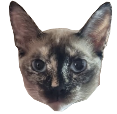

<p align="center">
  
</p>

# Yuuna

A lightweight, state-machine-based TypeScript game engine built for quick
prototypes — drop it into a page and it's running, no editor or build step
required. You describe your game as a `state`, a `render(state)` function,
and a `nextState({ state, event, keyboard })` function — Yuuna owns the
render loop, input handling, and canvas drawing. It's scratch paper for game
ideas, not a replacement for Godot or Unity.

## Install

```sh
npm install yuuna-engine
```

## Quick start

Add a canvas with `id="yuuna"` to your page:

```html
<canvas id="yuuna" width="960" height="540"></canvas>
```

Then describe your game as state + render + nextState:

```ts
import { runEngine } from "yuuna-engine";

type GameState = { cookies: number };

runEngine<GameState>({
  initialState: { cookies: 0 },

  render: (state) => ({
    renderables: [
      {
        type: "TEXT",
        text: `${state.cookies} cookies`,
        color: "black",
        position: { x: 100, y: 50 },
      },
      {
        type: "CIRCLE",
        id: "cookie",
        isClickable: true,
        color: "brown",
        position: { x: 50, y: 50 },
        radius: 25,
      },
    ],
  }),

  nextState: ({ state, event }) => {
    if (event.tag === "CLICK" && event.id === "cookie") {
      return { cookies: state.cookies + 1 };
    }

    return state;
  },
});
```

## Concepts

- **Renderables** — declarative shapes drawn each frame: `RECTANGLE`,
  `CIRCLE`, `TEXT`, and `SPRITE`. Give one an `id` plus `isClickable` /
  `isHoverable` / `trackMouseMovement` to make it interactive.
- **Events** — your `nextState` function receives one `GameEvent` per call:
  `TIME` (frame tick with `delta`), `CLICK`, `HOVER_IN`, `HOVER_OUT`, or
  `MOUSE_MOVE`.
- **Keyboard** — `nextState` also receives a `keyboard` map keyed by
  `KeyCode`-style keys (e.g. `"KeyW"`, `"ArrowLeft"`, `"Space"`), each with
  `isPressed` / `isJustPressed` / `isJustReleased`.
- **Sprites** — pass a `resources` map of `{ src, size, slices }` to
  `runEngine` to load spritesheets, then reference them by id with a
  `SPRITE` renderable's `resourceId` and `frame`.

## Development

```sh
yarn install
yarn build   # builds lib/ (npm package) and dist/bundle.js (landing page)
yarn watch   # rebuild on change
```

`dist/index.html` is the landing page — it loads `dist/bundle.js` in the
browser via a global `Yuuna` object and embeds a live Monaco editor so
visitors can edit and run a game directly on the page.

## License

MIT © [luci-dot-exe](https://github.com/lucy-dot-exe)
